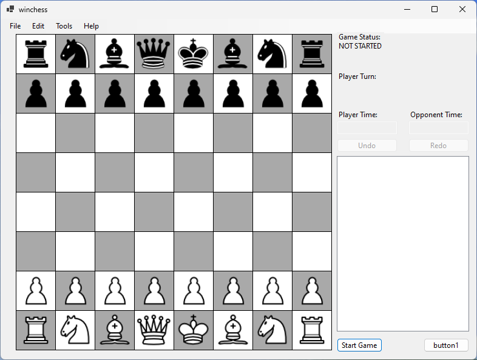

# WinChess



`WinChess` is a chess program that utilizes `C#`, `Windows Forms` and the [`Stockfish Chess Engine`](https://stockfishchess.org/).

## Chess Engine

`Stockfish` is an open source chess engine, that manages to constantly rank number one on chess engine rating lists. According to [Wikipedia](https://en.wikipedia.org/wiki/Stockfish_(chess)), it's estimated elo is around 3550 points. It has won the Top Chess Engine Championship 14 times and the Chess.com Computer Chess Championship 19 times. [Stockfish.NET](https://github.com/Oremiro/Stockfish.NET) is a **wrapper** library that implements the Stockfish game engint in C#.

As of the time writing this project, the wrapper library has been abandoned as of April 28, 2022. 

## Prerequisites

To start this program, you need to install the `Stockfish` executable, specifically v13.0. It can be found [here](https://www.dropbox.com/sh/75gzfgu7qo94pvh/AAB0vCuaC3EAD0PHKR1nqX7Ja/Stockfish%2013?dl=0&preview=stockfish_13_win_x64_avx2.zip&subfolder_nav_tracking=1).

After installing the zip file, you need to extract the `.exe` file anywhere on your computer.

Change the `ChessEngine` variable in `.\Source\Board.cs`, so it points to the executable's location:

```csharp
Board()
{
	...
	ChessEngine = new Stockfish.NET.Stockfish(@"C:\PATH\TO\EXECUTABLE.exe");
	...
}
```

## Functionality

Due to `Stockfish.NET` being a wrapper library and not a classic library, it has a lot of caveats (which will be discussed later). The user has to install the `Stockfish` chess engine v13 before the solution can be compiled. The limited funcionality, slow performance and many trade-offs have allowed us to create a half-baked chess game that still manages to impress. 

### FEN Strings

The Stockfish chess engine works by manipulating [FEN strings](https://en.wikipedia.org/wiki/Forsyth%E2%80%93Edwards_Notation). It is a string notation defined by David Forsyth and Steven J. Edwards. A starting chess board FEN string is displayed as follows:

```
rnbqkbnr/pppppppp/8/8/8/8/PPPPPPPP/RNBQKBNR w KQkq - 0 1
```

It consists of 6 parts:
- **Piece Placement**: This field represents the positions of the pieces on the board. Each rank (row) is described from the 8th rank to the 1st rank, starting from the '8' character.
	- Each piece is represented by a single letter, with uppercase letters for white pieces and lowercase letters for black pieces.
	- Pieces are represented as follows:
		- 'K' for king,
		- 'Q' for queen,
		- 'R' for rook,
		- 'B' for bishop,
		- 'N' for knight,
		- 'P' for pawn.
	- Empty squares are denoted by numbers representing the count of consecutive empty squares. For example, '3' represents three empty squares. The ranks are separated by '/'.
- **Active Color**: This field indicates which player has the current move. 'w' stands for white, and 'b' stands for black.
- **Castling Availability**: This field denotes whether castling is possible for either side. The four letters 'K', 'Q', 'k', and 'q' represent the ability to castle kingside and queenside for white and black, respectively. A hyphen '-' is used if castling is not possible.
- **En Passant Target Square**: If a pawn has made a two-square advance in the previous move, this field shows the square behind the pawn. Otherwise, it is represented by a hyphen '-'.
- **Halfmove Clock**: This field indicates the number of halfmoves (ply) since the last capture or pawn move. It helps determine if a draw can be claimed under the fifty-move rule in chess.
- **Fullmove Number**: This field represents the number of the current move. It starts at 1 and is incremented after each black move.

### The chessboard

The chessboard is represented by 64 `Tile` objects stored in a `List<List<Tile>>`. A `Tile` can either contain or not contain a chess `Piece` on it. Each `Piece` has it's `PieceType`, `PieceColor` and `Image` associated to it. A `Tile` can be represented either as a black or white chessboard tile.

### Moving pieces

Each time the player moves a piece, both the FEN string and the 2D List of Lists of `Tiles` get updated. By clicking on a `Tile` with a `Piece`, after a (slow) delay, all possible positions are displayed as yellow tiles on the chessboard.

### Move validation

`Stockfish.NET` can check if a move is valid by passing algebraic notation to the `IsMoveCorrect(string)` function. Each possible move is checked against the currently selected `Piece`'s location by using the `GeneratePieceMoves(Tile)` function:

```csharp
void GeneratePieceMoves(Tile Tile)
{
	for (char File = 'a'; File <= 'h'; File++)
	{
		for (int Rank = 1; Rank <= 8; Rank++)
		{
			string Move = $"{Tile.AlgebraicPosition}{File}{Rank}";
			if (ChessEngine.IsMoveCorrect(Move))
			{
				ValidMoves.Add(Tiles[8 - Rank][File - 'a']);
			}
		}
	}
}
```

### Piece coordinates and algebraic notation

When parsing the FEN string, each `Tile` gets it's respective `Point` on the chessboard. When constructing the `Tile`, a algebraic representation of those coordinates also get created. This is in order to more easily check for all possible moves for a `Piece` with the `GeneratePieceMoves(Tile)` function.

As an example, the `Tile` located at `6, 0` would have the algebraic notation of `a2`. When selecting `a2` as the tile, we would get that a pawn is present (at the beginning of the game) and get `a3` and `a4` as valid moves for the pawn at `a2`. 

### Updating the chessboard

Initially, when constructing the chessboard, a `SetFenPosition(string)` function is available to set a starting point for the board.

Internally, `Stockfish.NET` has a `SetPosition(params string[])` function, that (for some odd reason) accepts an array of `strings`. Each move is added to a `HashSet<string>`. Initially, our goal was to add each new move to a `Stack<string>`, but we will discuss later why this is not the case. Each move piles on top of each other, creating a "building" of moves. If we were to remove a move at random, the function would break and we got get a fancy `Error: Application has crashed` error, with no further explanation.

After updating the FEN string, we update the `List<List<Tile>>` by parsing the fen string and transforming it into a 2D `List`:

```csharp
List<List<Tile>> UpdateList(string FenString)
{
	List<List<Tile>> tiles = new List<List<Tile>>(64);
	string[] ranks = FenString.Split(' ')[0].Split('/');

	for (int x = 0; x < ranks.Length; x++)
	{
		List<Tile> files = new List<Tile>();
		string rank = ranks[x];
		int y = 0;

		foreach (char c in rank)
		{
			if (char.IsDigit(c))
			{
				int empty = int.Parse(c.ToString());
				for (int i = 0; i < empty; i++)
				{
					files.Add(new Tile(new Point(x, y), null, GetTileColor(x, y)));
					y++;
				}
			}

			else
			{
				files.Add(new Tile(new Point(x, y), c, GetTileColor(x, y)));
				y++;
			}
		}

		tiles.Add(files);
	}

	return tiles;
}
```

## Caveats

### Not really a library

`Stockfish.NET` is not a real library. The user **must** have an executable `Stockfish` chess engine installed on their computer in order for this "library" to communicate with it. This brings some serious issues that we have faced in the process of creating this program.
 
### Slow performance

The `IsMoveValid(string)` function takes a lot of time to determine whether a move is valid, even when passing one string to it. This is the reason why there is a delay between selecting the source piece and destination piece.

### Unresponsiveness

Users who launch this program will instantly recognize that half of the UI is filled with white boxes. We are unaware of the reason, but (unsurprisingly) believe it has something to do with `Stockfish.NET`. A temporary fix would be to "shake" the window each time you notice a freeze.

### Dialog windows do not show up

Again, due to `Stockfish.NET`. Initially, we aimed to implement the ability to change the tile's colors and have the ability to promote pawns, but this could not be achieved.

### Checking for checkmate

When issuing the final move for a checkmate, `GetEvaluation().Type` returns the string `mate`, but issues `Error: Application has crashed` right after (for unknown reasons). Despite this, the function is horribly slow and should be called each time the player/AI does a valid move, but we have commented it out in order to save the user from headaches.

### Undo & Redo

As mentioned before, we opted out from using `Stack<string>`. `Stockfish.NET` doesn't really like stacks and each time the user makes a move, the chessboard gets reset to default. We have left out this functionality, due to the horrendous experience with `Stockfish.NET` 

### Chat functionality

Our initial thoughts were to implement a chat system, but later decided it was redundant, because the user is playing against soulless AI.

## Why Stockfish.NET

Simple - it has 3550 ELO points and is smart enough to do [Queen's Gambit](https://en.wikipedia.org/wiki/Queen%27s_Gambit), which is the fastest way to a checkmate. You can try it yourself by doing these moves:

```
g2g3
f2f4
```

Additionally, we suffered so you don't have to. This has been a valuable lesson for all of us - don't work with wrapper libraries.

# LICENSE

This software is licensed under the [GPL v3.0 License](https://www.gnu.org/licenses/gpl-3.0.en.html).

# CONTRIBUTION

Any contributions are welcome.

# CREDITS

Bojan Milevski, 211561, SEIS
Kristijan Selchanec, 211543, SEIS
Damjan Gjorgjievski, 211539, SEIS
